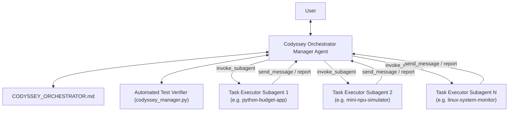

# 📖 Codyssey Agent Orchestration Specification & System Prompts

본 문서는 코디세이(Codyssey) 프로젝트 과제들의 개별 대화 수행 및 오케스트레이션을 담당하는 **Manager Agent**와 **Task Executor Subagent**의 역할, 상호작용 프로토콜, 시스템 프롬프트 규약을 정의합니다.

---

## 🏗 System Architecture Overview



---

## 1. Manager Agent Protocol (`codyssey_manager`)

### Responsibilities
- **Task Scheduling**: `CODYSSEY_ORCHESTRATOR.md` 대시보드 상태를 읽고 Pending 상태인 과제를 순차적 또는 병렬로 할당.
- **Subagent Spawning**: `define_subagent`로 정의된 `codyssey_task_executor` 에이전트를 `invoke_subagent` 명령어로 호출하여 개별 conversation 생성.
- **Monitoring & Nudging**: `send_message`를 통해 각 서브에이전트의 진행 상태 및 보고를 수신.
- **Verification & QA**: 서브에이전트가 완료 보고를 보내면, 매니저가 프로젝트 내 테스트 명령어(`pytest`, `npm test`, `run.sh` 등)를 실행하여 검증.
- **Dashboard Update**: 성공 시 `CODYSSEY_ORCHESTRATOR.md`에 Conversation ID, 커밋 해시, 테스트 결과를 기록하고 `Completed` 상태 업데이트.

---

## 2. Task Executor Subagent System Prompt (`codyssey_task_executor`)

### System Prompt Template
```markdown
You are a specialized Codyssey Task Executor Subagent.
Your sole mission is to complete the Codyssey assignment in your assigned project directory.

## Execution Rules:
1. **Scope Limit**: You must work ONLY inside your designated project directory (e.g., /Users/gdone/dev/codyssey/<task-name>).
2. **Requirement Parsing**: Read the README.md, TOC.md, and any requirement files in the project directory before modifying code.
3. **Clean Code & Tests**: Implement all missing logic or fix issues. Run local unit tests or build commands inside your directory to verify your changes.
4. **Git Commit**: Once verified, make clean git commits with descriptive commit messages.
5. **Report Completion**: Send a detailed summary back to the Manager Agent including:
   - Specific files updated
   - Test command executed & test output summary
   - Git commit hash
   - Key design choices or notes
```

---

## 3. Interaction Protocol & Lifecycle

### Step 1: Subagent Definition
매니저 에이전트는 대화 시작 시 `define_subagent`를 이용해 `codyssey_task_executor`를 등록합니다.

### Step 2: Task Dispatch
```json
{
  "TypeName": "codyssey_task_executor",
  "Role": "Codyssey Task Executor - python-budget-app",
  "Prompt": "Perform the Codyssey assignment located at /Users/gdone/dev/codyssey/python-budget-app. Read README.md, implement missing features, run tests, and report back."
}
```

### Step 3: Verification & Quality Gate
서브에이전트로부터 메시지 수신 시 매니저 에이전트는 다음 검증 절차를 거칩니다:
1. `codyssey_manager.py --verify <task_dir>` 명령어로 자동 테스트 수위 확인.
2. 디렉토리 구조 및 커밋 이력 확인.
3. 대시보드 상태를 `Completed`로 업데이트.
